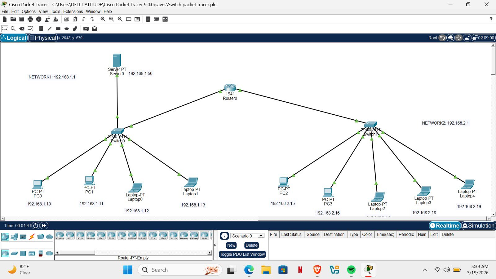

# 🖧 Office Network Design Using Cisco Packet Tracer

## Overview

This project demonstrates the design and configuration of a small office network using Cisco Packet Tracer.

## Scenario

A startup company recently moved into a new office and hired me as the IT support personnel. Before employees resumed work on Monday, my responsibility was to design and configure a reliable network that allowed all office devices to communicate seamlessly.

The office required:

- 2 Desktop PCs
- 2 Laptops
- 1 Server

To improve scalability and organization, I designed two subnetworks connected through a Cisco 1941 router. This setup enables communication between all devices while maintaining proper network segmentation.

## Network Topology

## Technologies Used

- Cisco Packet Tracer
- Cisco 1941 Router
- Cisco 2960 Switches
- IPv4 Addressing
- Static IP Addressing

## Skills Demonstrated

- Network Design
- Router Configuration
- Switch Configuration
- IP Addressing
- Network Troubleshooting
- Connectivity Testing

## Outcome

The network was successfully configured, allowing devices across both subnetworks to communicate with one another. The server was accessible from client devices, demonstrating a functional office network ready for day-to-day operations.
